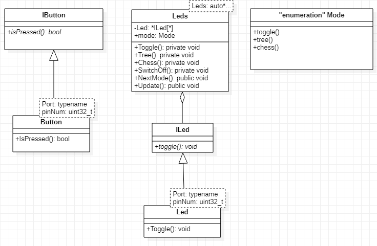

:figure-caption: Рисунок
:table-caption: Таблица

= Лабораторная №7-8-9
:toc:
:toc-title: ОГЛАВЛЕНИЕ:

== Задание

* Доделать дизайн, который позволяет настраивать любой режим моргания светодиодов, с любым количеством светодиодов, привязанных к любым пинам портов.

== Работа с программой

* Подключение необходимых шины.
* Назначение портов диодов как Выход.
* Назначение кнопку как Вход.

Код подключения:
[source, c++]
RCC::APB2ENR::SYSCFGEN::Enable::Set();
RCC::AHB1ENR::GPIOAEN::Enable::Set(); // Подключаем к шине
RCC::AHB1ENR::GPIOCEN::Enable::Set(); // Подключаем к шине
GPIOA::OSPEEDR::OSPEEDR5::MediumSpeed::Set();
GPIOA::MODER::MODER5::Output::Set();
GPIOC::OSPEEDR::OSPEEDR5::MediumSpeed::Set();
GPIOC::MODER::MODER5::Output::Set();
GPIOC::OSPEEDR::OSPEEDR9::MediumSpeed::Set();
GPIOC::MODER::MODER9::Output::Set();
GPIOC::OSPEEDR::OSPEEDR8::MediumSpeed::Set();
GPIOC::MODER::MODER8::Output::Set();
GPIOC::OSPEEDR::OSPEEDR13::MediumSpeed::Set();
GPIOC::MODER::MODER13::Input::Set();

Перед построением программы составим ее архитектуру.

=== Классы и его функции

=== Класс  Led
Данный класс используется для переопределения функции.

[source, c++]
#pragma once
#include "iled.h"
template<typename Port, uint32_t pinNum>
class Led : public ILed
{
public:
  void toggle() override
  {
    Port::ODR::Toggle(1U << pinNum);
  }
  void swicthOff() override
  {
     GPIOA::ODR::ODR5::Low::Set();
     GPIOC::ODR::ODR5::Low::Set();
     GPIOC::ODR::ODR8::Low::Set();
     GPIOC::ODR::ODR9::Low::Set();
  }
};

=== Класс Leds
Здесь описаны функции модов мигания диодов и их переключения

[source, c++]
#pragma once
#include "gpioaregisters.hpp" //for Gpioa
#include "gpiocregisters.hpp" //for GPIOC
#include "iled.h"
template <auto* ...pArgs>
struct Leds
{
 ILed* pLeds[sizeof ...(pArgs)] = {pArgs...};
 void toggle()
 {
   for (auto it: pLeds)
    {
     it ->toggle();
    }
 }
 void swicthOff()
 {
   for (auto it: pLeds)
    {
     it ->swicthOff();
    }
 }
 };

=== Виртуальный класс ILeds

[source, c++]
#pragma once
class ILed
{
public:
virtual void toggle() = 0;
virtual void swicthOff() = 0;
};

=== Класс Button

Описание функции отжима кнопки

[source, c++]
#pragma once
#include "ibutton.h"
template<typename Port, uint32_t pinNum>
class Button: public IButton
{
public:
  bool IsPressed() override
  {
    bool result = false;
    // Если кнопка прижата
    if(((Port::IDR::Get())&(1U << pinNum)) == 0)
    {
      //ждем пока не отпуститсся
      result = true;
    }
     return result;
  }
};

=== Виртуальный класс IButton

[source, c++]
#pragma once
class IButton
{
 public:
 virtual bool  IsPressed() = 0;
};

=== Класс Modes

[source, c++]
#pragma once
#include "imode.h"
template <auto* ...pArgs>
struct Modes
{
public:
 void Update()
 {
  pModes[modeIndex]->toggle();
 }
  void NextMode()
 {
   modeIndex++;
   if (modeIndex == std::size(pModes))
   {
    modeIndex = 0U;
   }
   pModes[modeIndex]->init();
 }
private:
 uint32_t modeIndex = 0U;
 IMode* pModes[sizeof ...(pArgs)] = {pArgs...};
};

=== Chess

[source, c++]
#pragma once
#include "imode.h"
template <auto& TLeds>
class Chess : public IMode
{
public:
  void toggle() const override
 {
  TLeds.toggle();
 }
  void init() const override
 {
    for ( uint32_t index =0; index < std::size(TLeds.pLeds); ++index)
  {
   if ((index %2)==0)
  {
   TLeds.pLeds[index]->toggle();
 }
}
}
};

=== Tree

[source, c++]
#pragma once
#include "imode.h"
template <auto& TLeds>
class Tree : public IMode
{
public:
void toggle() const override
{
  for ( uint32_t index =0; index < std::size(TLeds.pLeds); ++index)
 {
    TLeds.pLeds[index]->toggle();
   for (int i = 0; i < 500000; ++i)
  {
   asm volatile("");
  }
}
}
void init() const override
{
TLeds.swicthOff();
}
};

=== Main.с

[source, c++]
Led<GPIOA, 5U> led1;
Led<GPIOC, 5U> led2;
Led<GPIOC, 8U> led3;
Led<GPIOC, 9U> led4;
Leds<&led2,&led3, &led4,&led1> leds;
Button<GPIOC, 13U> userButton;
Chess<leds> chessMode;
All<leds> allMode;
Tree<leds> treeMode;
Modes<&allMode, &treeMode, &chessMode> modes;
int main()
{
   for (;;)
  {
    if (userButton.IsPressed())
   {
     modes.NextMode();
   }
    modes.Update();
    delay(1000000);
  }
return 1;
}

== Результат работы программы

image::1.gif[]
